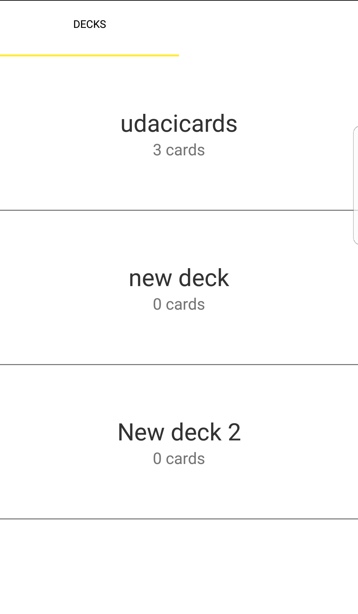
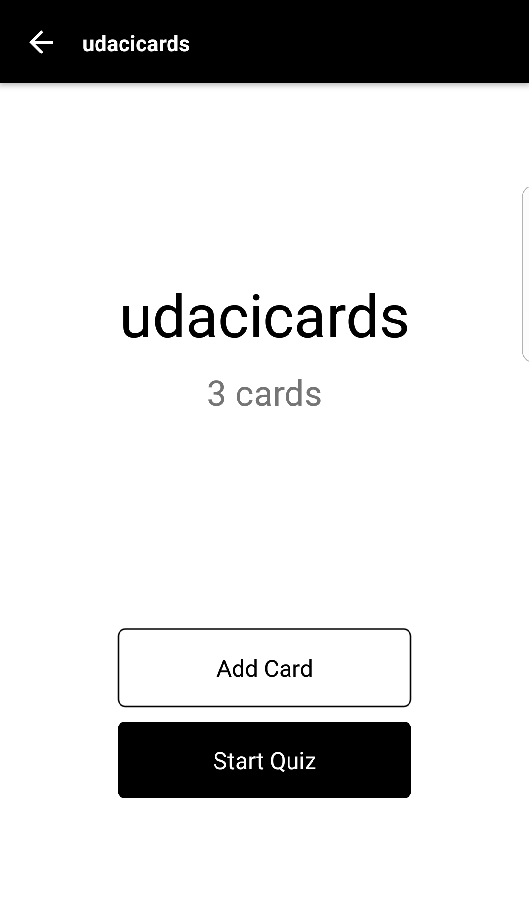
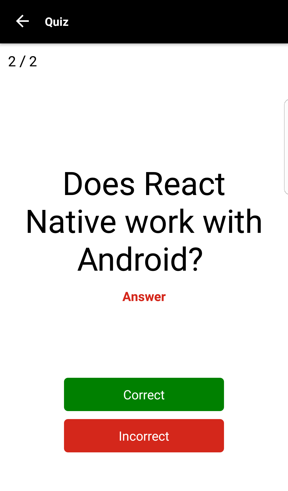
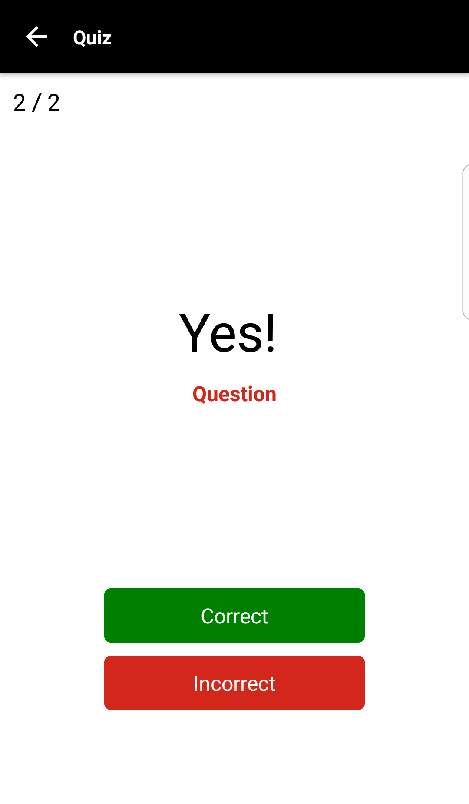
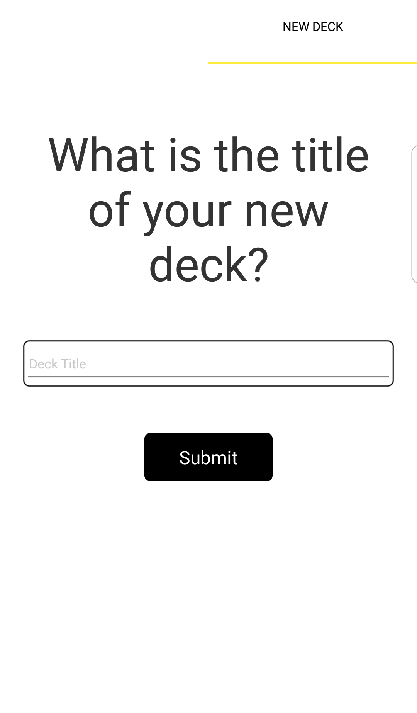

# Mobile Flashcards

This is the final mobile assessment project for 
Udacity's React & Redux course.

## Running the application

 - `yarn install` - for getting the required libs  
 - `yarn start` - for opening the application in browser

## Platform

This app was tested against the Android platform.

 
 ## Specific Requirements
 
 
 * Use create-react-native-app to build your project.
 * Allow users to create a deck which can hold an unlimited number of cards.
 * Allow users to add a card to a specific deck.
 * The front of the card should display the question.
 * The back of the card should display the answer.
 * Users should be able to quiz themselves on a specific deck and receive a score once they're done.
 * Users should receive a notification to remind themselves to study if they haven't already for that day.

**Views**

 The application should have, at a minimum, five views.
 
 Deck List View (Default View)
 
 * displays the title of each Deck
 * displays the number of cards in each deck
 
  
 
 ## Deck List View
 
 Individual Deck View
 
 * displays the title of the Deck
 * displays the number of cards in the deck
 * displays an option to start a quiz on this specific deck
 * An option to add a new question to the deck
 
  
 
 # Individual Deck View
 
 Quiz View
 
 * displays a card question
 * an option to view the answer (flips the card)
 * a "Correct" button
 * an "Incorrect" button
 * the number of cards left in the quiz
 * Displays the percentage correct once the quiz is complete
 
   
   
 #Quiz View
 
 
 
  

 #New Deck View
 
 * An option to enter in the title for the new deck
 * An option to submit the new deck title
 
 
 
 
 # New Question View
 * An option to enter in the question
 * An option to enter in the answer
 * An option to submit the new question
 
 
 

 Data
 We'll use AsyncStorage to store our decks and flashcards. Redux is optional for this project.
 
 Using AsyncStorage you'll manage an object whose shape is similar to this:
 
 {
   React: {
     title: 'React',
     questions: [
       {
         question: 'What is React?',
         answer: 'A library for managing user interfaces'
       },
       {
         question: 'Where do you make Ajax requests in React?',
         answer: 'The componentDidMount lifecycle event'
       }
     ]
   },
   JavaScript: {
     title: 'JavaScript',
     questions: [
       {
         question: 'What is a closure?',
         answer: 'The combination of a function and the lexical environment within which that function was declared.'
       }
     ]
   }
 }
 Notice each deck creates a new key on the object. Each deck has a title and a questions key. title is the title for the specific deck and questions is an array of questions and answers for that deck.